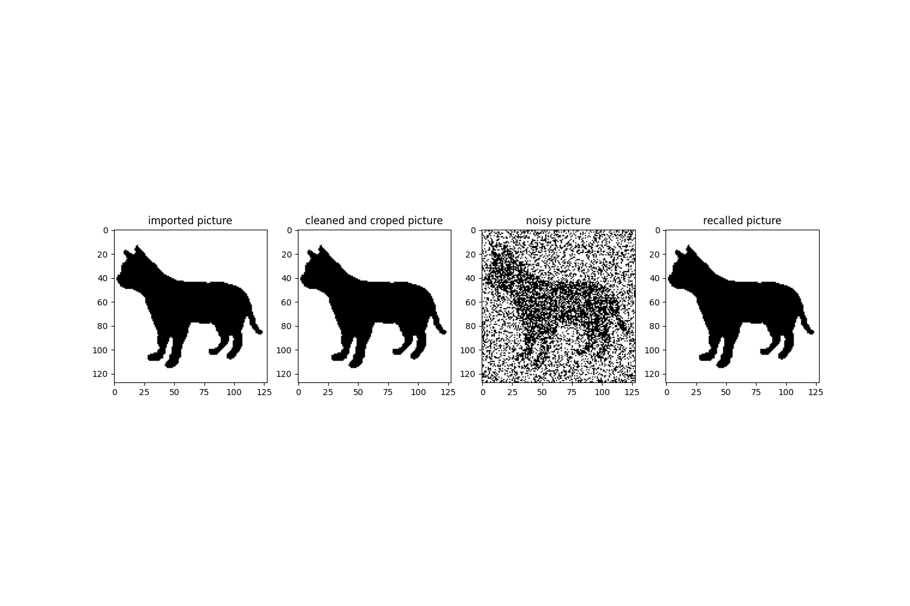
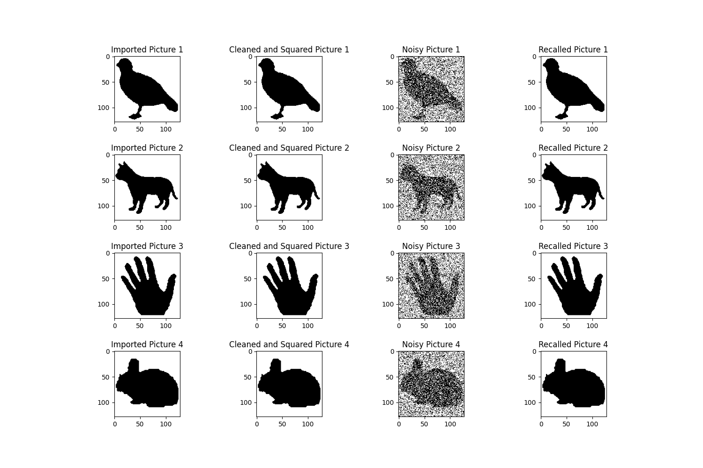

<h1 align="center">Hopfield Neural Network</h1>
<p align="center">
   
  
</p>

The Hopfield neural network is a type of artificial neural network. This network structure comprises interconnected neurons, with each neuron being binary and capable of taking values of either +1 or -1. Patterns or memories are stored in the network by configuring the neuron states to represent desired patterns, and an energy function is employed to describe the network's state.Hopfield networks also provide a model for understanding human memory.

## Description
A simple Hopfield neural network for recalling memories. The network is initially trained with a target image. The image is then corrupted with noise. The network then restores the target memory.Initially, acquisition and encoding of images into binary patterns, which serve as the fundamental units for storage within the Hopfield Neural Network. The network's architecture is designed to accommodate these patterns, allowing for the association of memories and efficient retrieval during recall.




## Installation Guide 

### Clone this repository
```bash
git clone https://github.com/CRei-7/Hopfield-Neural-Network.git
```
### Go into the repository
```bash
cd Hopfield-Neural-Network
```
### Install packages

```bash
pip install -r requirements.txt
```
### Run the program

```bash
python hopfield.py
```

## License

This project is licensed under the MIT License - see the [LICENSE](LICENSE) file for details.